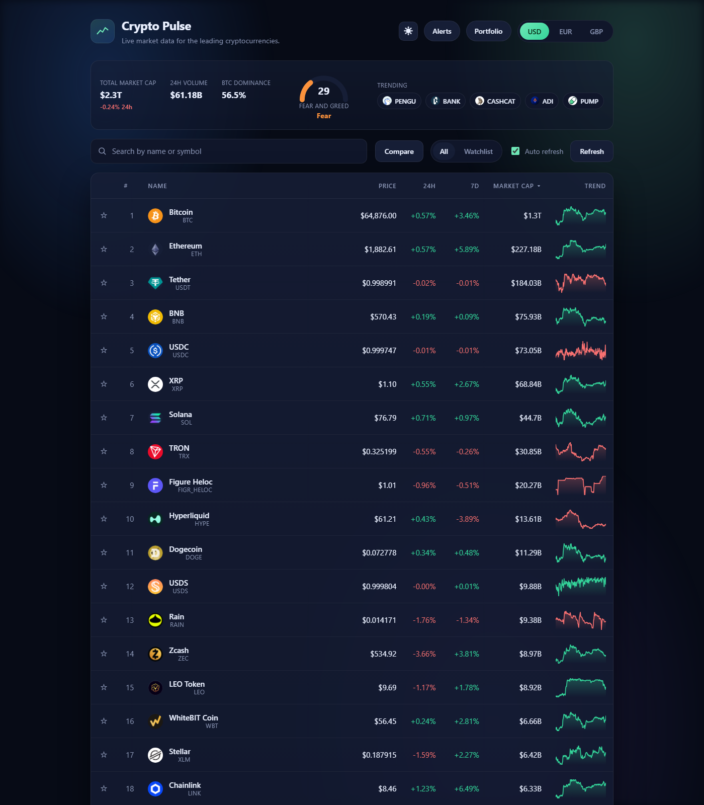

# Crypto Pulse

Live: https://kelsonlam.github.io/crypto-pulse/



Crypto Pulse is a live cryptocurrency market tracker built with React. It presents the leading cryptocurrencies by market capitalisation, shows how their prices have moved over the past day and week, and lets you open any coin to study its recent price history in more detail. The application draws all of its data from the CoinGecko public API, which does not require an API key, so the project runs straight away for anyone who clones it.

## Features

The interface is designed to be clear and pleasant to use. The main screen lists the top fifty coins in a sortable table, with a price, a 24 hour change, a 7 day change, a market capitalisation, and a small inline chart that summarises the past week at a glance.

You can search for any coin by its name or symbol, switch the display currency between US dollars, euros, and British pounds, and sort the table by price, recent change, or market capitalisation. Selecting a coin opens a detail panel with a larger, interactive chart. Moving the pointer across that chart reveals the price and the moment it was recorded, alongside a set of key statistics such as the 24 hour high and low and the all time high.

The data refreshes automatically once a minute while the page is open, and you can request a manual refresh at any time. If the data service is unavailable or busy, the application explains the situation plainly rather than failing in silence.

## Built with

The project uses React for the interface and Vite for the development server and the production build. The charts are drawn as inline SVG with no charting library, which keeps the dependency list short and the bundle small. The styling is written in plain CSS.

## Getting started

You will need Node.js version 18 or later installed on your computer.

First, install the dependencies:

```
npm install
```

Then start the development server:

```
npm run dev
```

Vite will print a local address, usually http://localhost:5173, which you can open in your browser.

To create an optimised production build, run:

```
npm run build
```

The build is written to the `dist` folder. You can preview that build locally with `npm run preview`.

## Deployment to GitHub Pages

The live site above is built and published automatically by the GitHub Actions workflow at `.github/workflows/deploy.yml`. Every push to `main` rebuilds and redeploys it; a deployment can also be triggered by hand from the repository's Actions tab.

The Vite configuration uses a relative base path, so the site works correctly whether it is served from the root of a domain or from a project subdirectory such as `your-username.github.io/crypto-pulse/`.

## A note on the data

All market data is provided by the CoinGecko public API. The free service applies a rate limit, so if you refresh very frequently you may occasionally see a short delay before the data loads. The figures shown are for general information only and are not financial advice.

## Project structure

```
crypto-pulse/
  index.html            The page shell that loads the application
  vite.config.js        Vite configuration
  src/
    main.jsx            The application entry point
    App.jsx             The main screen, table, and controls
    api.js              A small wrapper around the CoinGecko API
    format.js           Helpers for formatting prices and percentages
    index.css           All of the styling
    components/
      Sparkline.jsx     The inline 7 day trend chart used in the table
      PriceChart.jsx    The interactive chart used in the detail panel
      CoinDetail.jsx    The detail panel for a single coin
```

## Licence

This project is released under the MIT Licence. You are welcome to use it as a reference or a starting point for your own work.
